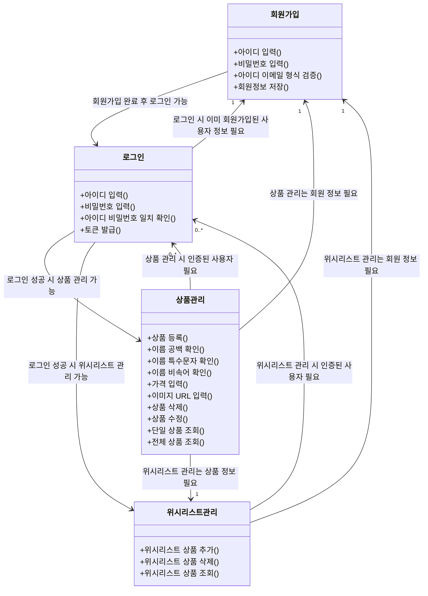
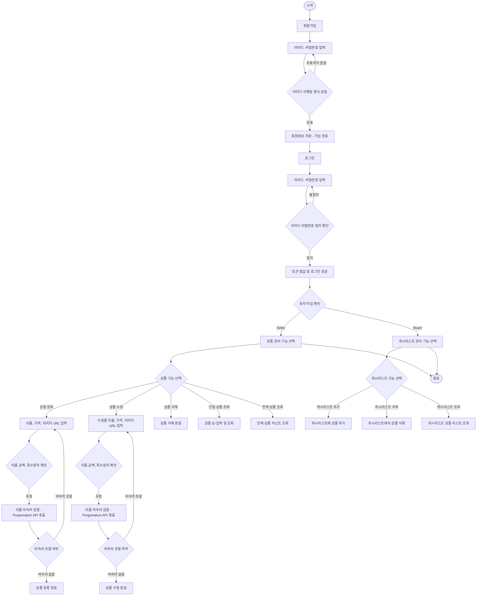
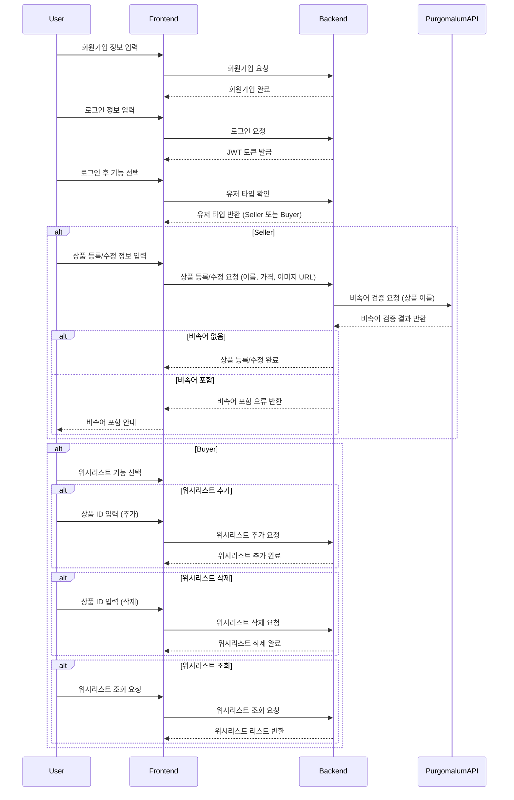

# spring-shopping-precourse

## 기능 요구 사항
온라인 쇼핑몰을 위한 간단한 HTTP API를 구현한다. HTTP 요청과 응답은 JSON 형식으로 주고받으며 스프링 프레임워크를 사용하여 웹 앱으로 구현한다.

### 상품
상품을 조회, 추가, 수정, 삭제할 수 있는 간단한 기능을 구현한다.
* 상품에는 이름과 가격, 이미지가 있다.
* 상품 이미지의 경우, 파일을 업로드하지 않고 URL을 직접 입력한다.

## 유효성 검사 및 예외 처리
상품을 추가하거나 수정하는 경우, 클라이언트로부터 잘못된 값이 전달될 수 있다. 잘못된 값이 전달되면 클라이언트가 어떤 부분이 왜 잘못되었는지 인지할 수 있도록 응답을 제공한다.
* 상품 이름은 공백을 포함하여 최대 15자리까지 입력할 수 있다.
* 특수문자
  * 가능: ( ), [ ], +, -, &, /, _
  * 그 외 특수 문자 사용 불가
* 상품 이름에는 비속어를 포함할 수 없다.
  * PurgoMalum에서 욕설이 포함되어 있는지 확인한다.

## 회원 로그인 
사용자가 회원 가입, 로그인, 추후 회원별 기능을 이용할 수 있도록 구현한다.
* 회원은 이메일과 비밀번호를 입력하여 가입한다.
* 토큰을 받으려면 이메일과 비밀번호를 보내야 하며, 가입한 이메일과 비밀번호가 일치하면 토큰이 발급된다. 
* 토큰을 생성하는 방법에는 여러 가지가 있다. 방법 중 하나를 선택한다.

## 위시 리스트
로그인 후 받은 토큰을 사용하여 사용자별 위시 리스트 기능을 구현한다.
* 위시 리스트에 등록된 상품 목록을 조회할 수 있다. 
* 위시 리스트에 상품을 추가할 수 있다.
* 위시 리스트에 담긴 상품을 삭제할 수 있다.

## API 명세
모든 백엔드 구현은 아래 API 명세를 준수해야 한다.

### 회원 API

| URL  | 메서드  | 기능    | 설명 |
|------|------|-------|----|
| /api/members/register | POST | 회원 가입 | 새 회원을 등록하고 토큰을 받는다. |
| /api/members/login | POST | 로그인   | 회원을 인증하고 토큰을 받는다. |

### 상품 API

| URL | 메서드  | 기능    | 설명               |
|-----|------|-------|------------------|
| /api/products| POST | 상품 생성 | 새 상품을 등록한다.      |
| /api/products/{productId} | GET  | 상품 조회 | 특정 상품의 정보를 조회한다. |
| /api/products/{productId} | PUT | 상품 수정 | 기존 상품의 정보를 수정한다. |
| /api/products/{productId} | DELETE | 상품 삭제 | 특정 상품을 삭제한다. |
| /api/products | GET | 상품 목록 조회 | 모든 상품의 목록을 조회한다. |

## 위시 리스트 API
| URL        | 메서드  | 기능           | 설명                    |
|------------|------|--------------|-----------------------|
|/api/wishes | POST | 위시 리스트 상품 추가 | 회원의 위시 리스트에 상품을 추가한다. |
|/api/wishes/{wishId} | DELETE | 위시 리스트 상품 삭제 | 회원의 위시 리스트에서 상품을 삭제한다.|
|/api/wishes | GET | 위시 리스트 상품 조회 | 회원의 위시 리스트에 있는 상품을 조회한다. |

--------------------------

## 구현 사항

### 회원
- [ ] 회원은 이메일을 갖고 있다.  
- [ ] 회원은 이메일/비밀번호를 입력하여 토큰을 발급받는다. 
- [ ] 위시 리스트에 상품을 등록할 수 있다.
- [ ] 위시 리스트에 담긴 상품을 삭제할 수 있다.
- [ ] 위시 리스트에 담긴 상품 목록을 조회할 수 있다.

### 상품
- [ ] 상품은 이름을 갖는다.
- [ ] 상품은 가격을 갖는다.
- [ ] 상품은 이미지(URL 형태)를 갖는다.
- [ ] 상품이름은 공백을 포함하여 최대 15자리이다.
- [ ] 특수문자는 아래 조건으로만 가능하다.
  * 가능: ( ), [ ], +, -, &, /, _
  * 그 외 특수 문자 사용 불가
- [ ] 상품 이름에는 비속어를 포함할 수 없다.
  * PurgoMalum에서 욕설이 포함되어 있는지 확인한다.

-------------------------

## 구현 사항 (테스트)

- [X] 상품을 조회한다.
- [ ] 상품을 추가한다.
- [ ] 상품을 수정한다.
- [ ] 상품을 삭제한다.

-------------------------

## 용어사전

| 한글명         | 영문명               | 변수명              | 설명                                                                            |
|-------------|-------------------|------------------|-------------------------------------------------------------------------------|
| 상품          | Product           | Product          | 이름, 가격, 이미지 정보를 가진다. Seller에 의해 온라인 쇼핑몰에 등록되어 판매되고 Buyer에 의해 위시리스트에 등록될 수 있다. |
| 이미지         | Image             | ImgUrl           | URL 형태로 되어 있고 상품의 이미지 정보를 불러온다.                                               |
| 가격          | Price             | Price            | 상품에 매겨진 금액으로 숫자로 되어 있다.                                                       |
| 이름          | Name              | Name             | 상품을 부르기 위한 이름                                                                 |
| 특수 문자       | Special Character | SpecialCharacter | 상품의 이름에 포함되는 문자형태로 일부 문자만 가능하다 (( ), [ ], +, -, &, /, _)                      |
| 비속어         | Profanity         | Profanity        | 상품이름에 포함될 수 없는 불건전한 언어 ( PurgoMalum으로 검증 )                                    |
| 토큰          | Token             | Token            | 로그인 시에 이메일과 비밀번호를 검증하여 발급된다.                                                  |
| 사용자(Buyer)  | Buyer             | Buyer            | 위시리스트를 등록하고 삭제하고 조회할 수 있는 사용자                                                 |
| 사용자(Seller) | Seller            | Seller           | 상품을 등록,삭제,수정,삭제할 수 있는 사용자                                                     |
| 위시리스트       | Wishlist          | Wishlist         | 사용자(Buyer)가 조회,등록,삭제할 수 있는 상품의 목록                                             |

-------------------------

* 회원가입 : 아이디 , 비밀번호 입력 -> 아이디 이메일형식 검증 -> 회원정보 저장 (가입완료)
* 로그인 : 아이디, 비밀번호 입력 -> 아이디 비밀번호 일치확인 -> 일치하면 토큰 발급
* 상품관리 : 상품 등록 -> 이름 공백확인, 특수문자, 비속어 확인, 가격 이미지 유알엘 더해서 등록
* 상품관리 : 상품 삭제 -> 등록된 상품을 삭제 한다
* 상품관리 : 상품 수정 -> 수정을 위한 이름, 가격, 이미지 유알엘 입력 받고 -> 이름의 경우 공백, 특수문자, 비속어 등 확인해서 -> 등록된 상품의 정보를 수정한다
* 상품 관리 : 단일 상품 조회 -> 상품 조회에 필요한 productId 입력 받아서 해당 Id를 갖고있는 상품 정보를 불러온다
* 상품관리 : 전체 상품 조회 -> 모든 상품의 리스트를 불러온다
* 위시리스트 관리 : 위시리스트 상품 추가 -> productId정보를 입력받는다 -> 위시리스트에 상품을 추가한다. (편집됨)
* 위시리스트 관리 : 위시리스트 상품 삭제 -> productId = wishId 정보를 입력 받는다 -> 해당아이디의 상품을 위시리스트에서 삭제한다
* 위시리스트 관리 : 위시리스트 상품 조회 -> 회원의 위시리스트에 있는 상품 리스트를 조회한다.

-------------------------

## 모델링

* 클래스 다이어그램

* 플로우 차트

* 시퀀스 다이어그램

